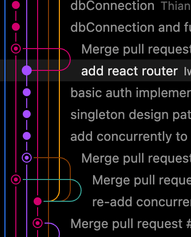
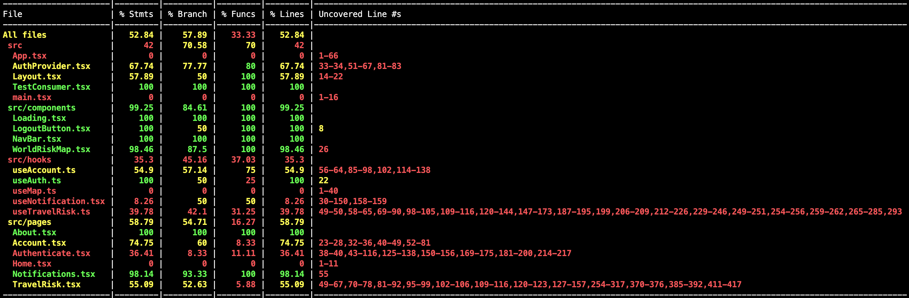
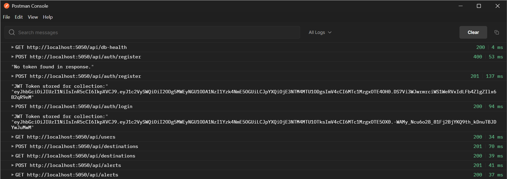

# Monkey and River Hackathon | Team 11

Hi! We're the ever-so-strong team 11 participating in the Monkey and River Hackathon 2025! This hackathon project built in less than 15 hours focuses on Travel Risk. This project is an example of an essential tool that can be used by both insurance companies and individuals looking to travel the world!

## Demo

## Architecture
For our architecture we decided to go with a simple client/server architecture. Not only does this help for a tight deadline, but also allows for a simple and easy-to-understand platform. Furthermore the code is also designed in such a way that it can run concurrently with a single command. Our server makes use of the singleton design pattern to prevent creating multiple instances of a DB connection or Express instance.

## Coding Standards
Little time to set these in place, but we managed to enforce Gitflow as well as CI for our unit tests. We also moved most of the logic to hooks, which allowed us to make each file have a single intent.

## Technologies
For our frontend, we went with React as most of us were familiar with it. Our backend made use of Node.js and Express. The API calls from the frontend were proxied in order to bypass potential CORS errors. Our MongoDB database is hosted on MongoDB Atlas and allowed us for quick prototyping with the powerful Mongoose modelling framework. Furthermore, for UI we used PrimeReact as a UI framework as well as TailwindCSS to customise the UI to our needs. As a development and build tool, we made use of Vite.

## Testing

For testing we used Vitest as our framework of choice. Furthermore, we made use of CodeCov to track our code coverage on the `main` branch. As seen in the figure below, we tried to maximise the coverage by testing each file a bit.

We also tested the API endpoints on Postman

### How to test
In order to run the tests, please follow the steps:
1. Run `cd client`
2. Run `npm install`
3. Run `npm run test` to get a coverage report

## User-centric Design
Our focus was to provide the user with a clean and easy-to-use interface. The UI framework really helped us sync up the styling across the app. This gives the user a sense of familiarity when visiting new pages. However, there are lot to be done in terms of UI, we tried to eliminate those components that might confuse the user.
<h2>Pages :</h2>  
<ol>
  <li><strong>Home</strong>   
Heatmap mapping countries to visit on trip and their risk level on a scale of 1-100
   </li>
  <li><strong>About</strong>   
Brief description of group info
 
</li>
  <li><strong>Account</strong>   
Account details to be edited here
 
</li>
  <li><strong>Authenticate</strong>   
This is both the log in and register form handling the needed logic for encoding passwords
 
</li>
  <li><strong>Travel Risk</strong>   
A datatable where destinations can be added, removed and edited for a trip with the needed details like risk level
   </li>
  <li><strong>Notifications</strong>   
This is a list of notifications for actions like register, log in, adding a destinations etc...
  
  </li>
  
</ol>

## Meet the Team

- Iwan de Jong ([LinkedIn](https://linkedin.com/in/iwandejong), [GitHub](https://github.com/iwandejong))

